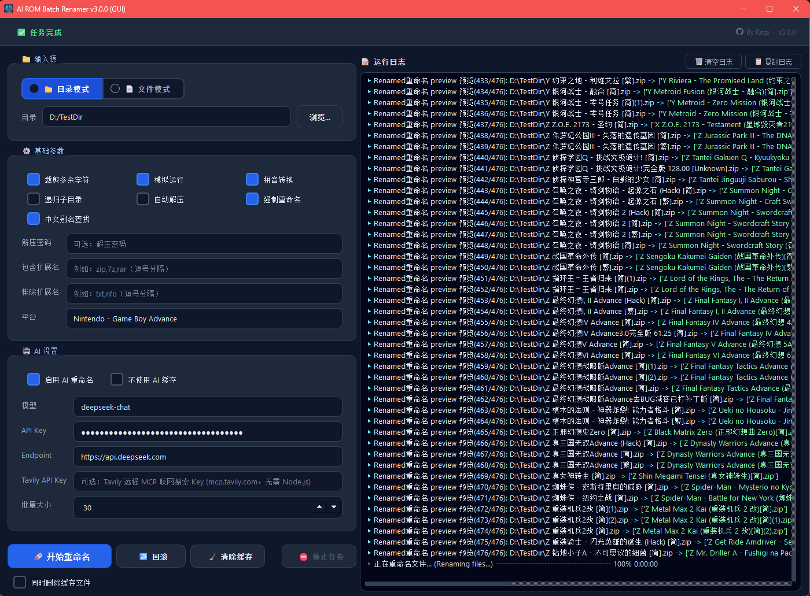
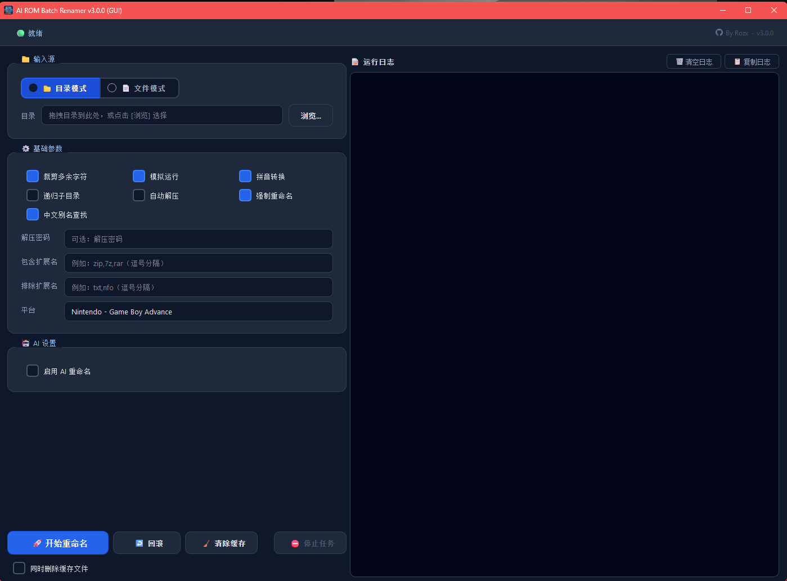

# 🎮 ROM AI Batch Renamer | ROM AI批量重命名工具

A powerful CLI/GUI tool for batch renaming ROM files using local alias lookup + AI technology.

一个支持终端/GUI、结合本地别名查找与 AI 技术的 ROM 批量重命名工具。


[](https://github.com/rozx/AI-ROMS-batch-renamer/releases)
[](https://github.com/rozx/AI-ROMS-batch-renamer/releases)
[](https://github.com/rozx/AI-ROMS-batch-renamer/issues)

## 📥 Downloads | 下载

**[🔗 Click here to download | 点击这里下载](https://github.com/rozx/AI-ROMS-batch-renamer/releases/latest)**

## 🆕 What's New in v3.0.0 | v3.0.0 新功能

> **v3.0.0** brings two major additions on top of the existing AI-powered workflow:
>
> **v3.0.0** 在原有 AI 工作流基础上新增两大核心功能：

### 🖥️ New GUI | 全新图形界面

A polished **PySide6-based desktop GUI** is now available — no terminal required.  
All rename, revert, and cache-management operations are fully accessible through the GUI, and it stays in sync with CLI behavior.

全新 **PySide6 桌面 GUI** 正式上线，无需使用终端。  
重命名、还原、缓存管理等所有操作均可在界面中完成，与 CLI 行为完全一致。



```bash
poetry run main gui   # launch via CLI / 通过 CLI 启动
poetry run gui        # dedicated entry point / 独立入口
```

### 📖 Local English & Chinese Title Lookup | 本地英/中文标题查找

`--cn-lookup` now resolves **both English and Chinese titles** offline from the bundled platform CSV database — no API key needed.  
The lookup uses multi-step fuzzy matching (exact → fuzzy → alias), prefers USA / World region entries, and returns results in the same format as the AI module so results can be seamlessly combined.

`--cn-lookup` 现在可从内置平台 CSV 数据库离线解析**英文与中文标题**，无需 API 密钥。  
查找采用多步模糊匹配（精确→模糊→别名），优先返回 USA / World 区版本，输出格式与 AI 模块完全兼容，可无缝混用。

```bash
# Local lookup only — zero API calls
# 仅使用本地查找，无任何 API 调用
renamer rename --cn-lookup --platform "GBA" --directory "~/ROMs/GBA" -t -py

# Best combo: local DB first, AI fills remaining gaps
# 最佳组合：本地优先，AI 补全剩余
renamer rename --cn-lookup --ai --platform "GBA" --directory "~/ROMs/GBA" -t -py --ai-batch-size 15
```

---

## ✨ Features | 功能特性

- 🤖 **AI-Powered Renaming**: Intelligent file renaming using advanced AI models  
  **AI智能重命名**: 使用先进AI模型进行智能文件重命名
- 🖥️ **Modern GUI** *(new in v3.0.0)*: Full-featured PySide6 desktop interface — no terminal needed, fully in sync with CLI  
  **全新桌面 GUI** *（v3.0.0 新增）*：功能完整的 PySide6 桌面界面，无需终端，与 CLI 行为完全一致
- 📖 **Local English & Chinese Title Lookup** *(new in v3.0.0)*: Resolve both English and Chinese game titles offline from the bundled CSV database (`--cn-lookup`) — zero API calls, multi-step fuzzy matching, USA/World region preference  
  **本地英/中文标题查找** *（v3.0.0 新增）*：通过内置 CSV 数据库离线解析英文与中文游戏标题（`--cn-lookup`），无需 API，支持多步模糊匹配，优先 USA/World 区版本
- 🧠 **Batch AI Enrichment**: Query multiple filenames in one request (`--ai-batch-size`) to reduce latency & cost  
  **批量AI增强**: 使用批量查询降低延迟与成本
- 🧩 **Platform Alias Normalization**: Accept common platform aliases and normalize to canonical names (`--platform`)  
  **平台别名归一化**: 支持常见平台别名输入并自动归一化为标准平台名（`--platform`）
- 🔤 **Pinyin Support**: Add pinyin initials for better sorting and searching  
  **拼音支持**: 添加拼音首字母以便更好地排序和搜索
- 📁 **Batch Processing**: Process multiple files and directories (with recursion)  
  **批量处理**: 支持递归处理多个文件与目录
- 🔄 **Revert Capability**: Easily restore original filenames  
  **还原功能**: 轻松恢复原始文件名
- 🗜️ **ZIP Support**: Extract and rename files from ZIP archives (with optional password)  
  **ZIP支持**: 支持解压（含密码）并重命名压缩包内容
- 🎯 **File Filtering**: Include or exclude specific file types  
  **文件过滤**: 包含或排除特定文件类型
- 🌐 **Platform-Aware**: Optimize AI enrichment via platform hints (`--platform`)  
  **平台感知**: 通过平台提示优化 AI 结果
- 🔍 **Tavily MCP Web Search**: Augment AI renaming with live web search via the Tavily remote MCP server (`--tavily-api-key`) — no Node.js required  
  **Tavily MCP 联网搜索**: 通过 Tavily 远程 MCP 服务器（`mcp.tavily.com`）为 AI 重命名增加实时网络搜索支持，无需安装 Node.js
- 💾 **Smart Caching**: Avoid duplicate AI calls (disable with `--ai-no-cache`)  
  **智能缓存**: 避免重复 AI 请求（可用 `--ai-no-cache` 禁用）
- 🛡️ **Safe Idempotent Runs**: Skip already-renamed files unless forced (`--force`)  
  **安全幂等**: 自动跳过已处理文件，除非使用 `--force`
- 🧹 **Filename Trimming**: Remove noisy segments before enrichment (`--trim`)  
  **文件名清理**: 清理噪声后再进行处理
- 🧼 **Cache Management**: Clear cache data or delete cache files (`clear-cache`)  
  **缓存管理**: 支持清空缓存数据或删除缓存文件（`clear-cache`）

## 📖 Examples | 示例

### Before → After | 重命名前后对比

| Original                                                       | Renamed                                                                                          |
| -------------------------------------------------------------- | ------------------------------------------------------------------------------------------------ |
| `黄金太阳 - 失落的时代[Mobile&Elffinal](简)(UE)(128Mb).zip`    | `H Golden Sun - The Lost Age (黄金太阳 - 失落的时代) [简].gba`                                   |
| `哈利波特 - 阿兹卡班的逃犯[施珂昱](简)(JP)(128Mb).zip`         | `H Harry Potter and the Prisoner of Azkaban (哈利波特 - 阿兹卡班的逃犯) [简].gba`               |
| `指环王－王者归来(0.4b小字体)[Advance-004](简)(JP)(136Mb).zip` | `Z The Lord of the Rings - The Return of the King (指环王 - 王者归来) [简].gba`                  |
| `王国之心 - 记忆之链[天使汉化组](简)(JP)(256Mb).zip`           | `W Kingdom Hearts - Chain of Memories (王国之心 - 记忆之链) [简].gba`                           |

## 🚀 Usage | 使用方法

```bash
renamer [command] [options]
```

### 📋 Global Options | 全局选项

```text

Commands:
  rename [options]       批量重命名文件 (Batch rename files)
  revert [options]  还原文件名 (Revert file names)
  gui                   启动图形界面 (Launch GUI)
  clear-cache [options] 清除缓存数据 (Clear cache data)
  about                 显示关于信息 (Show about information)
```

## 🖥️ GUI Mode | 图形界面模式



### Launching | 启动方式

```bash
# via CLI app command
poetry run main gui

# via dedicated script entry
poetry run gui
```

- Requires `PySide6` dependency.
  **需要安装 `PySide6` 依赖。**
- GUI internally calls CLI commands, so behavior/exit codes stay consistent.
  **GUI 内部复用 CLI 命令，行为与退出码保持一致。**
- All settings are persisted between sessions.
  **所有设置会在会话间自动保存。**

### 📐 Layout Overview | 界面布局

The window is split into two panels:

| Panel | Description |
| ----- | ----------- |
| **Left** | Settings — input source, options, AI config, action buttons |
| **Right** | Live log output with copy / clear controls |

The divider between the two panels is draggable.  
分隔线可拖动调整两侧宽度。

### 📁 Input Source | 输入源

Select between **Directory mode** (📂) or **File mode** (📄) using the radio buttons at the top of the source panel.

- **Directory mode**: Enter or browse to a folder path, or **drag & drop a folder** onto the field.
- **File mode**: Enter one or more file paths (separated by `;`), or **drag & drop multiple files** at once.

**目录模式**：输入或浏览目录路径，也可直接**拖拽文件夹**到输入框。  
**文件模式**：输入一个或多个文件路径（用 `;` 分隔），也可**拖拽多个文件**到输入框。

### ⚙️ Basic Options | 基础参数

| Checkbox | CLI Equivalent | Description |
| -------- | -------------- | ----------- |
| 裁剪多余字符 | `--trim` | Strip noisy tags from filenames before processing |
| 模拟运行 | `--dry-run` | Preview results only — no files are changed |
| 拼音转换 | `--pinyin` | Prepend pinyin initial for sorting |
| 递归子目录 | `--recursive` | Process files in subdirectories |
| 自动解压 | `--unzip` | Extract ZIP archives then rename contents |
| 强制重命名 | `--force` | Re-process already-renamed files |
| 中文别名查找 | `--cn-lookup` | Resolve titles offline from local CSV database (requires Platform) |

Additional fields:

| Field | CLI Equivalent | Description |
| ----- | -------------- | ----------- |
| 解压密码 | `--password` | Password for encrypted ZIP archives |
| 包含扩展名 | `--includes` | Comma-separated extensions to process (e.g. `gba,zip`) |
| 排除扩展名 | `--excludes` | Comma-separated extensions to skip (e.g. `txt,nfo`) |
| 平台 | `--platform` | Platform hint — supports autocomplete and alias normalization (e.g. type `gb` → `Game Boy`) |

### 🤖 AI Settings | AI 设置

Tick **启用 AI 重命名** to expand the AI section.

| Field / Checkbox | CLI Equivalent | Description |
| ---------------- | -------------- | ----------- |
| 不使用 AI 缓存 | `--ai-no-cache` | Force fresh AI calls, skip local cache |
| 模型 | `--model` | Model identifier (e.g. `gpt-4o-mini`, `deepseek-chat`) |
| API Key | `--api-key` | Override the saved API key |
| Endpoint | `--endpoint` | Custom OpenAI-compatible base URL |
| Tavily API Key | `--tavily-api-key` | Enable live web search via `mcp.tavily.com` (no Node.js needed) |
| 批量大小 | `--ai-batch-size` | Number of filenames sent per AI request (1–100, default 10) |

### 🎬 Action Buttons | 操作按钮

| Button | Description |
| ------ | ----------- |
| 🚀 **开始重命名** | Run the rename operation with current settings |
| ↩️ **回滚** | Revert renamed files back to their original names |
| 🧹 **清除缓存** | Clear AI cache data; tick **同时删除缓存文件** to also delete the cache files on disk |
| ⛔ **停止任务** | Interrupt a running operation |

### 📝 Log Panel | 日志面板

The right-hand panel streams real-time output from the underlying CLI process.  
右侧面板实时显示底层 CLI 进程的输出。

| Button | Description |
| ------ | ----------- |
| 🗑 清空日志 | Clear the log display |
| 📋 复制日志 | Copy the full log to clipboard |

## 📝 Rename Command | 重命名命令

### Syntax | 语法

```bash
renamer rename [options]
```

### 🛠️ Options | 选项参数

| Option            | Short    | Type | Description                                                    |
| ----------------- | -------- | ---- | -------------------------------------------------------------- |
| `--directory`     | `-dir`   | TEXT | 要重命名的文件夹路径 (Directory path to rename files in)       |
| `--files`         | `-files` | TEXT | 要重命名的文件（支持分号/换行分隔多个文件） (Files to rename; supports multiple paths separated by semicolon or newline) |
| `--trim`          | `-t`     | FLAG | 去除无用的信息 (Trim noisy segments from filename)             |
| `--dry-run`       | `-d`     | FLAG | 只输出结果，不实际重命名 (Preview only; no changes)            |
| `--pinyin`        | `-py`    | FLAG | 在开头加上拼音首字符 (Add pinyin initial for sorting)          |
| `--includes`      | `-i`     | TEXT | 只处理特定扩展 (Only process these extensions; repeatable)     |
| `--excludes`      | `-e`     | TEXT | 排除特定扩展 (Skip these extensions; repeatable)               |
| `--output`        | `-o`     | FLAG | 只输出新文件名 (Print new names only; quiet mode)              |
| `--recursive`     | `-r`     | FLAG | 递归处理子目录 (Process subdirectories)                        |
| `--unzip`         | `-u`     | FLAG | 解压 zip 再处理 (Unzip archives then rename contents)          |
| `--password`      | `-pwd`   | TEXT | zip 文件密码 (Password for encrypted ZIP)                      |
| `--ai`            | `-ai`    | FLAG | 使用 AI 获取游戏信息 (Enable AI enrichment)                    |
| `--model`         | `-model` | TEXT | AI 模型 (Model identifier)                                     |
| `--api-key`       | `-key`   | TEXT | AI API 密钥 (Override API key)                                 |
| `--endpoint`      | `-ep`    | TEXT | AI API 端点 (Custom base URL)                                  |
| `--platform`      | `-p`     | TEXT | 平台提示 (Platform hint: GBA, NDS, PSX...)                     |
| `--ai-batch-size` |          | INT  | AI 批量查询大小 (Batch size for multi-file AI requests)        |
| `--ai-no-cache`   | `-nc`    | FLAG | 禁用 AI 缓存 (Disable caching; force fresh calls)              |
| `--force`         | `-f`     | FLAG | 强制重命名已处理文件 (Force rename even if previously renamed) |
| `--cn-lookup`     | `--cn`   | FLAG | 使用本地中文别名数据库查找游戏名称，需要 --platform (Use local Chinese alias DB for title lookup, requires --platform) |
| `--tavily-api-key` | `-tav`  | TEXT | Tavily 远程 MCP Key，连接 mcp.tavily.com 进行联网搜索增强，无需 Node.js (Tavily API key for web-augmented AI renaming via the remote MCP server — no Node.js required) |

### 💡 Example Usage | 使用示例

#### 🖥️ GUI (Beginner-friendly) | 图形界面（推荐新手）

Launch the GUI, drag your ROM folder onto the directory field, set your platform, tick the options you need, and click **🚀 开始重命名**.  
启动 GUI，将 ROM 目录拖入输入框，选择平台，勾选所需选项，点击 **🚀 开始重命名** 即可。

```bash
poetry run gui
# or: poetry run main gui
```

#### ⌨️ CLI | 命令行

```bash
# ── Preview first (always recommended) ──────────────────────────────────────
# 预览模式（始终建议先预览）
renamer rename -d -t -py -p GBA -dir "~/ROMs/GBA"

# ── Local title lookup only — no API key needed ──────────────────────────────
# 仅使用本地标题查找，无需 API 密钥
renamer rename --cn-lookup -p GBA -t -py -dir "~/ROMs/GBA"

# ── Local lookup + AI fallback (recommended for Chinese ROM sets) ─────────────
# 本地查找 + AI 补全（中文 ROM 合集推荐）
renamer rename --cn-lookup --ai -p GBA -t -py --ai-batch-size 15 -dir "~/ROMs/GBA"

# ── AI only (with a custom DeepSeek endpoint) ────────────────────────────────
# 单独使用 AI（自定义 DeepSeek 端点）
renamer rename --ai -p GBA -t -py \
  -model "deepseek-chat" -ep "https://api.deepseek.com" -key "your_api_key" \
  --ai-batch-size 20 -dir "~/ROMs/GBA"

# ── Ultimate: local DB + AI + Tavily live web search ─────────────────────────
# 终极组合：本地库 + AI + Tavily 联网搜索
renamer rename --cn-lookup --ai --tavily-api-key "tvly-xxxx" \
  -p GBA -t -py --ai-batch-size 15 -dir "~/ROMs/GBA"

# ── Single file ──────────────────────────────────────────────────────────────
# 处理单个文件
renamer rename --cn-lookup --ai -p GBA -files "~/ROMs/GBA/黄金太阳.zip"
```

### 🔧 Common Scenarios | 常见场景

```bash
# Dry run → execute (recommended two-step workflow)
# 先预览后执行（推荐两步工作流）
renamer rename -d -r --cn-lookup --ai -p GBA --ai-batch-size 15 -t -py -dir "~/ROMs/GBA"
renamer rename    -r --cn-lookup --ai -p GBA --ai-batch-size 15 -t -py -dir "~/ROMs/GBA"

# Force re-process files that were already renamed
# 强制重新处理已重命名的文件
renamer rename -r --cn-lookup --ai -f -p GBA -dir "~/ROMs/GBA"

# Recursive rename across all subdirectories
# 递归处理所有子目录
renamer rename -r --cn-lookup --ai -p NDS --ai-batch-size 20 -t -py -dir "~/ROMs/"

# Filter to specific extensions only
# 仅处理特定扩展名
renamer rename -r --cn-lookup -p GBA -i gba -i zip -t -py -dir "~/ROMs/GBA"

# Unzip encrypted archives then rename
# 解压加密压缩包后重命名
renamer rename -r -u -pwd "mypassword" --ai -p NDS -i zip -t -dir "~/Incoming/"

# Pinyin-only pass (no lookup, no AI)
# 仅添加拼音首字母（无任何查找）
renamer rename -py -t -dir "~/ChineseRoms"

# Force fresh AI results, bypass cache
# 强制跳过缓存，重新请求 AI
renamer rename -r --ai -p GBA --ai-no-cache -dir "~/ROMs/GBA"

# Quiet mode — print new names only (useful for scripting)
# 静默模式 — 仅输出新文件名（脚本管道时使用）
renamer rename -r --cn-lookup --ai -p GBA -o -dir "~/ROMs/GBA"
```

### ⚡ Quickstart | 快速开始

1. Install dependencies | 安装依赖

```bash
git clone https://github.com/rozx/AI-ROMS-batch-renamer.git
cd AI-ROMS-batch-renamer
poetry install
```

2. **GUI (easiest)** — launch and configure visually | 图形界面（最简单）

```bash
poetry run gui
```

3. **CLI** — dry-run preview first | 命令行 — 先预览

```bash
# Local lookup preview (no API key needed)
# 本地查找预览（无需 API 密钥）
poetry run main rename -d -r --cn-lookup -p GBA -t -py -dir "~/ROMs/GBA"

# With AI
# 使用 AI
poetry run main rename -d -r --cn-lookup --ai -p GBA --ai-batch-size 15 -t -py -dir "~/ROMs/GBA"
```

4. Execute for real | 实际执行

```bash
poetry run main rename -r --cn-lookup --ai -p GBA --ai-batch-size 15 -t -py -dir "~/ROMs/GBA"
```

5. Revert if needed | 如需还原

```bash
poetry run main revert -d -dir "~/ROMs/GBA"   # preview revert / 预览还原
poetry run main revert    -dir "~/ROMs/GBA"   # execute revert / 执行还原
```

6. Build onefile binary | 构建单文件可执行

```bash
poetry run build --verbose
```

#### ✅ Recommended Workflow | 推荐工作流

| Step | Action | Rationale |
| ---- | ------ | --------- |
| 1 | Launch GUI **or** use CLI with `-d` (dry run) | 先确认结果安全再执行 |
| 2 | Enable `--trim` + `--pinyin` | 清理噪声，优化排序 |
| 3 | Set `--platform` | 更精确的标题匹配 |
| 4 | Enable `--cn-lookup` | 本地优先，节省 AI 配额，无需 API 密钥 |
| 5 | Add `--ai` with `--ai-batch-size 15` | AI 补全本地未能识别的标题 |
| 6 | Optionally add `--tavily-api-key` | 联网搜索补全冷门 ROM 标题 |
| 7 | Use `--force` only if reprocessing | 避免无意义重复处理 |

#### 🔍 Tips | 小贴士

- **New to the tool?** Start with the GUI — drag your folder in, set the platform, tick `--cn-lookup`, and hit start.  
  **初次使用？** 从 GUI 开始，拖入目录，选择平台，勾选中文别名查找，点击开始。
- `--cn-lookup` resolves both English **and** Chinese titles offline from the bundled CSV database — no API key required.  
  `--cn-lookup` 可离线从内置 CSV 数据库解析**英文和中文**标题，无需 API 密钥。
- Combine `--cn-lookup` with `--ai` for best results: local DB handles known titles, AI fills the gaps.  
  **结合 `--cn-lookup` 与 `--ai` 效果最佳**：本地数据库处理已知标题，AI 补全缺失。
- When `--ai` is enabled with `--platform`, fuzzy CSV candidates are automatically passed to the AI as context hints even without `--cn-lookup`.  
  启用 `--ai` 并指定 `--platform` 时，即使不启用 `--cn-lookup`，也会自动将 CSV 模糊候选作为上下文提示传给 AI。
- Add `--tavily-api-key` for live web search via `mcp.tavily.com` — no Node.js needed. Especially useful for obscure or poorly-named ROMs.  
  添加 `--tavily-api-key` 可通过 `mcp.tavily.com` 进行实时联网搜索，无需 Node.js，对冷门 ROM 特别有效。
- Avoid `--ai-no-cache` for large runs unless debugging.  
  大量处理时避免使用 `--ai-no-cache`，除非需要调试最新结果。
- Keep `renamerHistory.cache` safe — it is required for the revert command.  
  请妥善保存 `renamerHistory.cache`，还原功能依赖此文件。

#### 🛡️ Safety | 安全

- Always keep backups of curated ROM sets.  
  **务必保留 ROM 集合的备份，以防意外修改。**
- Run a dry-run (`-d`) on a copy first if unsure.  
  **不确定时先用 `-d` 在副本上预览，确认结果再处理正式目录。**
- Encrypted ZIPs are handled only if a password is provided; errors skip gracefully without aborting.  
  **加密 ZIP 需提供密码才能处理，出错会跳过而不中断整体流程。**

### 📤 Sample Output | 输出示例

```text
铁臂阿童木-阿童木之心的秘密[v1.0][心灵的冬天](简)(66Mb).zip
→ T Astro Boy - The Video Game (铁臂阿童木 - 阿童木之心的秘密) [简].gba
```

## ↩️ Revert Command | 还原命令

### Syntax (Revert) | 语法（还原）

```bash
renamer revert [options]
```

### 🛠️ Options (Revert) | 选项参数（还原）

| Option        | Short    | Type | Description                                                  |
| ------------- | -------- | ---- | ------------------------------------------------------------ |
| `--directory` | `-dir`   | TEXT | 要还原文件名的文件夹路径 (Directory path to revert files in) |
| `--files`     | `-files` | TEXT | 要还原的文件（支持分号/换行分隔多个文件） (Files to revert; supports multiple paths separated by semicolon or newline) |
| `--recursive` | `-r`     | FLAG | 处理子目录 (Process subdirectories)                          |
| `--dry-run`   | `-d`     | FLAG | 预览还原结果 (Preview revert results)                        |

## 🚦 Exit Codes | 退出码

- `0`: Success / 成功
- `1`: Generic failure (I/O, permission) / 通用失败（I/O、权限等）
- `2`: Invalid arguments or missing input / 参数非法或缺少输入
- `3`: AI API error / AI 请求错误
- `4`: ZIP extraction failure / ZIP 解压失败

### 💡 Example Usage (Revert) | 使用示例（还原）

```bash
# Revert all files in directory
# 还原目录中的所有文件
renamer revert --directory "D:/Downloads/"

# Dry run revert
# 预览还原结果（不实际执行）
renamer revert --dry-run --directory "~/ROMs/"
```

### 📤 Sample Output (Revert) | 输出示例（还原）

```text
T Astro Boy - The Video Game (铁臂阿童木 - 阿童木之心的秘密) [简].gba
→ 铁臂阿童木-阿童木之心的秘密[v1.0][心灵的冬天](简)(66Mb).gba
```

## 🧼 Clear Cache Command | 缓存清理命令

### Syntax (Clear Cache) | 语法（清理缓存）

```bash
renamer clear-cache [options]
```

### 🛠️ Options (Clear Cache) | 选项参数（清理缓存）

| Option             | Short | Type | Description                                                          |
| ------------------ | ----- | ---- | -------------------------------------------------------------------- |
| `--delete-files`   | `-d`  | FLAG | 删除整个缓存目录与缓存文件 (Delete cache directory and cache files)  |
| `--yes`            | `-y`  | FLAG | 跳过确认提示 (Skip confirmation prompt)                             |

### 💡 Example Usage (Clear Cache) | 使用示例（清理缓存）

```bash
# Clear cache data only (keep files)
# 仅清空缓存数据（保留缓存目录）
renamer clear-cache

# Delete cache directory without prompt
# 删除缓存目录且不提示确认
renamer clear-cache -d -y
```

## ⚙️ Config & Cache Paths | 配置与缓存路径

- AI 配置文件默认保存在用户配置目录：
  - Windows: `%APPDATA%/ai-rom-batch-renamer/config.json`
  - Linux/macOS: `$XDG_CONFIG_HOME/ai-rom-batch-renamer/config.json`（未设置时回退到 `~/.config/...`）
- 兼容旧版：若工作目录存在 `config.json`，会自动迁移到新目录。
- 缓存目录使用系统临时目录：`<temp>/ai-rom-batch-renamer`
  - `renamerRomInfoCache.cache`：AI 元数据缓存
  - `renamerHistory.cache`：重命名历史（revert 依赖）

## 🛠️ Build from Source | 从源码构建

```bash
# 1) Install dependencies
poetry install

# 2) Build cross-platform onefile binary (dynamic spec)
poetry run build --verbose

# 3) Build GUI only
poetry run build --target gui --verbose

# 4) Build both terminal + GUI in one command
poetry run build --target both --verbose

# Options:
#   --target cli|gui|both   构建终端版 / GUI版 / 同时构建（默认 cli）
#   --outdir ./dist         指定输出目录
#   --name my-binary        自定义输出文件名
#   --icon ./assets/icos/icon.ico    Windows 图标
#   --icon ./assets/icos/icon.icns   MacOS 图标
#   --no-windows-disable-console      GUI 版在 Windows 保留控制台窗口
#   --extra ...             追加原生 Nuitka 参数
#   --dry-run               仅打印命令，不实际构建
```

版本来源优先级：环境变量 APP_VERSION > pyproject.toml 中的 version。

## 🔁 Versioning & Releases | 版本与发布

- CI 使用 Release Drafter 计算版本标签（例如 `v2.1.0`）。
- 构建任务下载标签并设置 `APP_VERSION`，然后执行 `APP_VERSION="$APP_VERSION" poetry run bump` 以同步版本文件。
- 构建调用 `poetry run build --verbose`，并在每个平台生成两类产物：Terminal（`main.py`）与 GUI（`gui.py`）。
- 产物以版本号命名并上传至同一个草稿发布（每个平台各 2 份压缩包）。

如果你更偏向以本地 `pyproject.toml` 为真源（Option A），也可以直接基于其版本创建发布并跳过标签到版本的转换。

## 🔧 Version bump (local) | 本地版本号更新

本仓库使用 bump2version 同步版本至多个文件（`pyproject.toml` 与 `ai_rom_batch_renamer/modules/const.py`）。

配置文件：`.bumpversion.cfg`

```bash
# 交互式选择 patch/minor/major
poetry run bump

# 直接按位更新
poetry run bump-patch
poetry run bump-minor
poetry run bump-major
```

在 CI 的 Option B 模式下（Release Drafter 生成 tag），构建任务会设置 `APP_VERSION` 环境变量并运行统一脚本：

```bash
# 同步 pyproject.toml 与 ai_rom_batch_renamer/modules/const.py
APP_VERSION="$APP_VERSION" poetry run bump
```

如果提供了 `APP_VERSION`，该脚本会直接写入对应版本；否则会回退为 patch 自动递增。这样应用的 About/版本输出将与发布标签一致。

## 🗺️ Roadmap | 开发路线图

- [x] ✅ **AI ROM Title Fetch** - *(v2.0.0)*  
  **AI ROM标题获取** *(v2.0.0)*
- [x] ✅ **Original Filename Storage** - For revert functionality *(v2.0.0)*  
  **原始文件名存储** - 用于还原功能 *(v2.0.0)*
- [x] ✅ **AI-Powered Prettification** - Enhanced naming with AI *(v2.0.0)*  
  **AI智能美化** - 使用AI增强命名 *(v2.0.0)*
- [x] 🔄 **Multiple AI Model Support** - Support for different AI providers  
  **多AI模型支持** - 支持不同的AI提供商
- [x] 🔄 **Third-party OpenAI API Integration** - Extended API compatibility
  **第三方OpenAI API集成** - 扩展API兼容性
- [x] 🔄 **Local cache** - Improve performance and reduce API calls
  **本地缓存** - 提高性能并减少API调用
- [x] ✅ **GUI Support** *(v3.0.0)* - Full-featured PySide6 desktop GUI, fully integrated with CLI behavior; supports all rename/revert/cache operations  
  **图形界面支持** *（v3.0.0）* - 功能完整的 PySide6 桌面 GUI，与 CLI 行为完全一致，支持重命名/还原/缓存全部操作
- [x] ✅ **Local English & Chinese Title Lookup** *(v3.0.0)* - Offline English + Chinese title resolution from bundled CSV database via `--cn-lookup`; multi-step fuzzy matching, USA/World region preference, no API key required  
  **本地英/中文标题查找** *（v3.0.0）* - 通过 `--cn-lookup` 从内置 CSV 数据库离线解析英文与中文标题，多步模糊匹配，优先 USA/World 区版本，无需 API 密钥
- [x] ✅ **Tavily Remote MCP Web Search** - AI renaming augmented with live web search via `mcp.tavily.com`; no Node.js required (`--tavily-api-key`)  
  **Tavily 远程 MCP 联网搜索** - 通过 `mcp.tavily.com` 为 AI 重命名增加实时网络搜索，无需 Node.js（`--tavily-api-key`）

## 📝 License | 许可证

This project is open source and available under the [MIT License](LICENSE).

该项目为开源项目，遵循 [MIT 许可证](LICENSE)。

## 🙏 致谢

[rom-name-cn](https://github.com/yingw/rom-name-cn) - ROM 名称的中英文对照

## 🤝 Contributing | 贡献

Contributions are welcome! Please feel free to submit a Pull Request or open an Issue.

欢迎贡献！请随时提交 Pull Request 或创建 Issue。

---

Made with ❤️ for retro gaming enthusiasts

为复古游戏爱好者用心制作 ❤️


